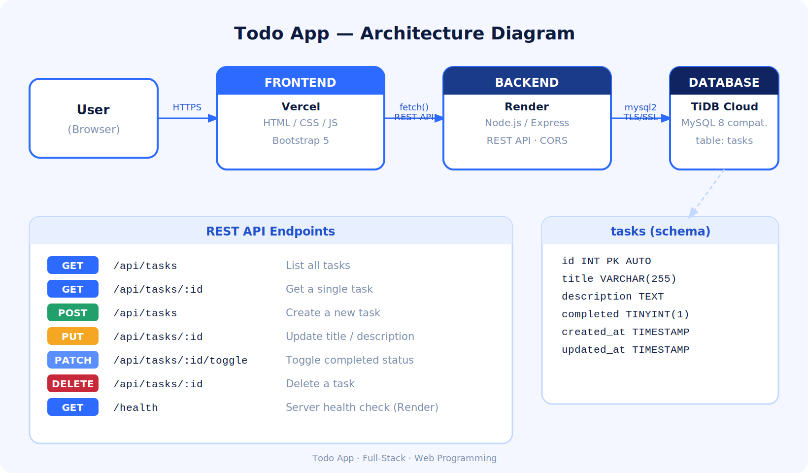
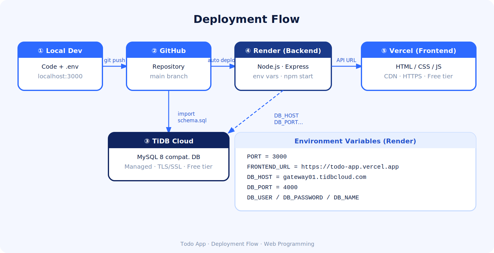

# Technical Documentation — Todo App

## 1. Platform Selection Justification

### Frontend → Vercel
- Automatic deployment on every push to GitHub (`main` branch).
- Optimized for static sites (HTML/CSS/JS) — no build step needed.
- Unlimited free tier with global CDN included.

### Backend → Render
- Native support for Node.js / Express.
- Environment variables managed directly from the dashboard.
- Automatic deployment from GitHub; zero manual server setup.
- Free tier available (service may take ~30s to wake on first request).

### Database → TiDB Cloud
- Fully managed MySQL-compatible (MySQL 8) serverless database.
- No server configuration required; credentials available immediately.
- Supports standard `mysql2` driver — no code changes needed vs. local MySQL.
- Built-in TLS/SSL encryption on all connections.
- Free Serverless tier with 25 GB storage and 250M Request Units/month.
- Advantage over Railway: TiDB Cloud is purpose-built for MySQL workloads, offers better connection pooling, and has a more generous free tier for production use.

---

## 2. Architecture Diagram



---

## 3. Deployment Flow Diagram



---

## 4. Database Schema

```sql
CREATE TABLE tasks (
  id          INT           NOT NULL AUTO_INCREMENT,
  title       VARCHAR(255)  NOT NULL,
  description TEXT,
  completed   TINYINT(1)    NOT NULL DEFAULT 0,
  created_at  TIMESTAMP     NOT NULL DEFAULT CURRENT_TIMESTAMP,
  updated_at  TIMESTAMP     NOT NULL DEFAULT CURRENT_TIMESTAMP
                            ON UPDATE CURRENT_TIMESTAMP,
  PRIMARY KEY (id)
) ENGINE=InnoDB DEFAULT CHARSET=utf8mb4;
```

---

## 5. Environment Variables

| Variable | Description | Example |
|---|---|---|
| `PORT` | Server port | `10000` |
| `FRONTEND_URL` | Frontend URL (CORS) | `https://todo-app.vercel.app` |
| `DB_HOST` | TiDB Cloud gateway host | `gateway01.us-east-1.prod.aws.tidbcloud.com` |
| `DB_PORT` | TiDB Cloud port | `4000` |
| `DB_USER` | Database username | `private` |
| `DB_PASSWORD` | Database password | `private` |
| `DB_NAME` | Database name | `todo_db` |

---

## 6. Deployment Steps Followed

### Phase 1 — Local Preparation
1. Project separated into `/frontend` and `/backend`.
2. Verified API and DB work locally with `.env` file.
3. Added `dotenv` support; removed all hardcoded credentials.

### Phase 2 — Database (TiDB Cloud)
1. Created account at tidbcloud.com.
2. Created a new **Serverless** cluster (free tier).
3. Copied connection credentials from **Connect → General**.
4. Imported `backend/db/schema.sql` via the **SQL Editor**.

### Phase 3 — Backend (Render)
1. Created account at render.com.
2. New → Web Service → connected GitHub repository.
3. Root directory: `backend` | Build: `npm install` | Start: `node index.js`.
4. Added all environment variables in the Render dashboard.
5. Deployed and copied the public API URL.

### Phase 4 — Connect Backend to TiDB Cloud
1. Confirmed env variables are correct in Render.
2. Verified logs show `✅ MySQL connection established.`

### Phase 5 — Frontend (Vercel)
1. Created account at vercel.com.
2. Import Git Repository → selected the repo.
3. Root Directory: `frontend`.
4. Updated `API_URL` in `js/app.js` with the Render URL.
5. Deployed; confirmed UI loads and API calls succeed.

### Phase 6 — Integration Testing
- Create task ✅
- Read task list ✅
- Edit title/description ✅
- Toggle completed ✅
- Delete task ✅
- No CORS errors ✅
- No console errors ✅

---

## 7. Challenges & Solutions

| Problem | Cause | Solution |
|---|---|---|
| CORS error in production | `FRONTEND_URL` misconfigured | Updated Render env var to exact Vercel URL |
| Backend not starting on Render | Hardcoded `PORT` | Used `process.env.PORT` |
| TiDB connection refused | Wrong port (3306 instead of 4000) | Updated `DB_PORT=4000` in env vars |
| Frontend calling local API | `API_URL` still pointed to `localhost` | Updated to Render public URL before deploy |
| Render service "sleeping" | Free tier limitation | First request takes ~30s; health check endpoint helps keep it alive |
